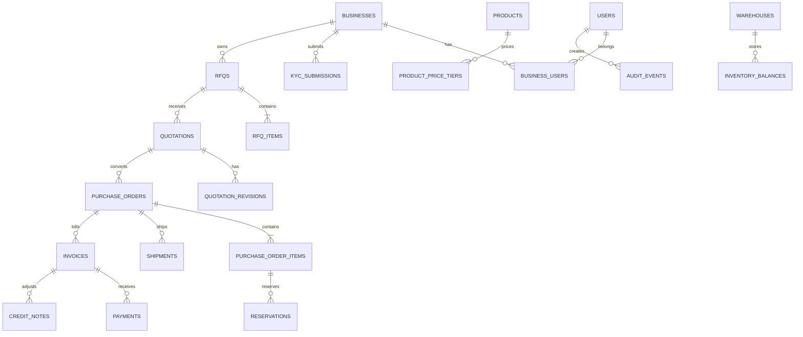

# Proposed PostgreSQL ERD

```mermaid
erDiagram
  BUSINESSES ||--o{ BUSINESS_USERS : has
  USERS ||--o{ BUSINESS_USERS : belongs
  BUSINESSES ||--o{ KYC_SUBMISSIONS : submits
  PRODUCTS ||--o{ PRODUCT_PRICE_TIERS : prices
  BUSINESSES ||--o{ RFQS : owns
  RFQS ||--|{ RFQ_ITEMS : contains
  RFQS ||--o{ QUOTATIONS : receives
  QUOTATIONS ||--o{ QUOTATION_REVISIONS : has
  QUOTATIONS ||--o{ PURCHASE_ORDERS : converts
  PURCHASE_ORDERS ||--|{ PURCHASE_ORDER_ITEMS : contains
  WAREHOUSES ||--o{ INVENTORY_BALANCES : stores
  PURCHASE_ORDER_ITEMS ||--o{ RESERVATIONS : reserves
  PURCHASE_ORDERS ||--o{ SHIPMENTS : ships
  PURCHASE_ORDERS ||--o{ INVOICES : bills
  INVOICES ||--o{ PAYMENTS : receives
  INVOICES ||--o{ CREDIT_NOTES : adjusts
  USERS ||--o{ AUDIT_EVENTS : creates
```

Exact columns, indexes and foreign keys require owner decisions on identifier strategy, currency, tax and multi-company scope.
